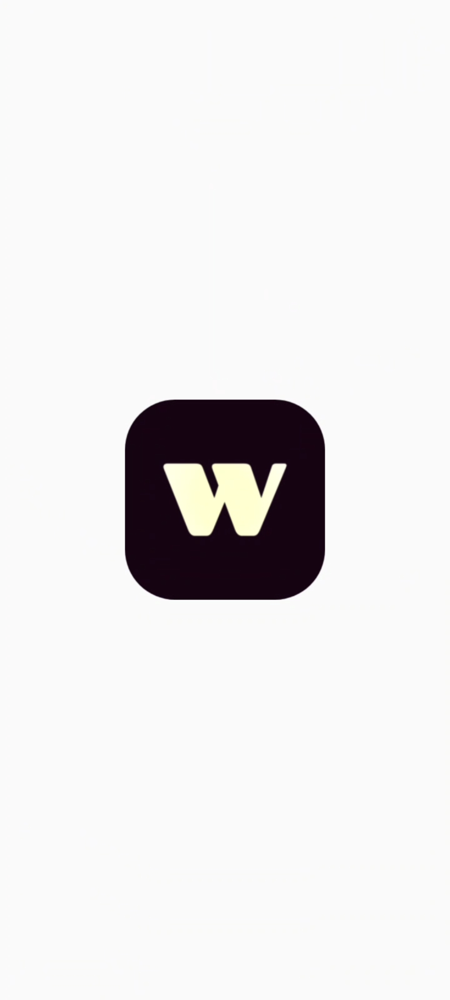
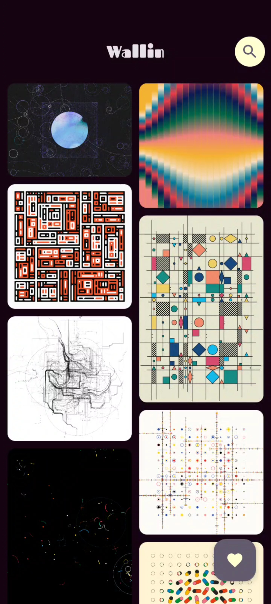
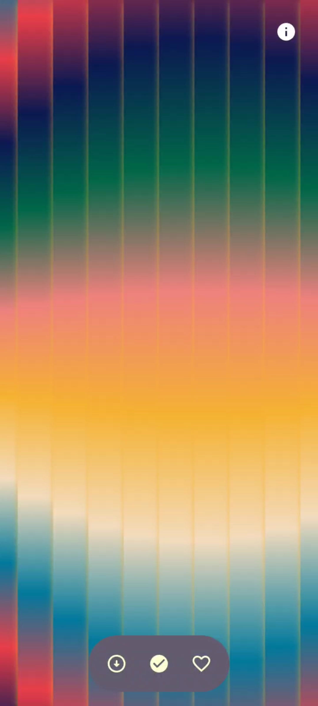
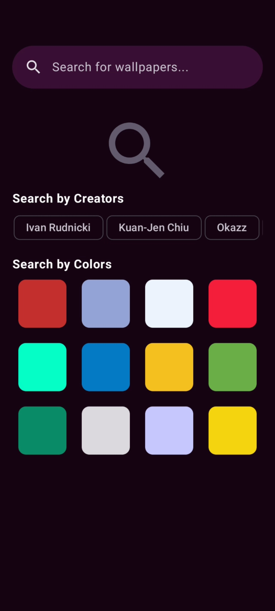
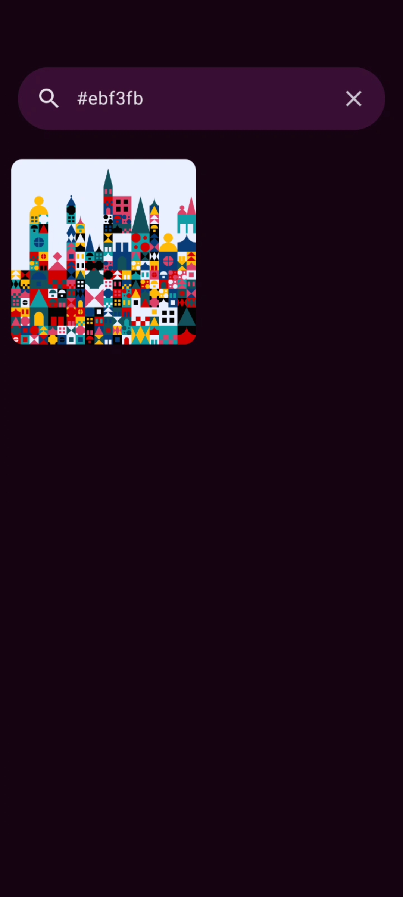

<div align="center">

# Wallin
[](https://opensource.org/licenses/MIT)
[](https://developer.android.com/studio)

</div>

## Project Description

This Android application, titled "Wallin," allows users to browse and download wallpapers. It features a clean and intuitive user interface built with Jetpack Compose, offering functionalities such as fetching images from a backend server, searching for specific wallpapers, setting wallpapers on the home screen and lock screen, and managing favorite images. The app utilizes modern Android architecture components like Room for local data storage, Retrofit for network requests, and Hilt for dependency injection.

## Key Features

*   **Browse Wallpapers**: Displays a grid of wallpapers fetched from a remote API.
*   **Search Functionality**: Allows users to search for wallpapers based on keywords.
*   **Favorite Management**: Enables users to save and manage their favorite wallpapers.
*   **Wallpaper Setting**: Provides options to set wallpapers on the home screen, lock screen, or both.
*   **Offline Support**: Caches images locally using Room for offline viewing.
*   **Pull-to-Refresh**: Updates wallpaper content by refreshing the content.

## Screenshots
<table>
  <tr>
    <td></td>
    <td></td>
    <td></td>
  </tr>
  <tr>
    <td></td>
    <td></td>
    <td></td>
  </tr>
  <tr>
    <td colspan="3" align="center">
      
    </td>
  </tr>
</table>


## Table of Contents

*   [Installation](#installation)
*   [Running the Project](#running-the-project)
*   [Dependencies](#dependencies)
*   [Contributing](#contributing)
*   [License](#license)


## Installation

To set up the project locally, follow these steps:

1.  Clone the repository:

    ```bash
    git clone https://github.com/Kaushal-0071/wallpaper-app.git
    ```

2.  Open the project in Android Studio.

3.  Configure the `BASE_URL` in `app/src/main/java/com/example/wallpaper/data/util/Constants.kt` to point to your backend server:

    ```kotlin
    object Constants {
        const val BASE_URL = "http://your_backend_server_ip:5000"
        // ... other constants
    }
    ```

4.  Build the project using Gradle.

## Running the Project

To run the project, use the following steps:

1.  Ensure you have an Android emulator or a physical Android device connected.
2.  In Android Studio, click the "Run" button or use the shortcut `Shift + F10`.
3.  Select your connected device or emulator.
4.  The app will launch on your selected device.

## Dependencies

The project relies on the following major dependencies:

*   **AndroidX Core KTX**: Core extensions for Kotlin.
*   **Jetpack Compose**: Modern toolkit for building native Android UI.
*   **Hilt**: Dependency injection library for Android.
*   **Room**: Persistence library for local data storage.
*   **Retrofit**: Type-safe HTTP client for Android.
*   **Kotlinx Serialization**: Kotlin library for handling JSON serialization.
*   **Coil**: Image loading library for Android Compose.
*   **Lottie Compose**: Library to render Lottie animations.

## Contributing

Contributions are welcome! Here's how you can contribute:

1.  Fork the repository.
2.  Create a new branch for your feature or bug fix.
3.  Implement your changes and ensure they are well-tested.
4.  Submit a pull request with a clear description of your changes.

## License

This project is licensed under the MIT License - see the [LICENSE](LICENSE) file for details.

